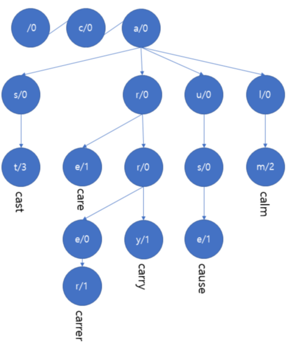
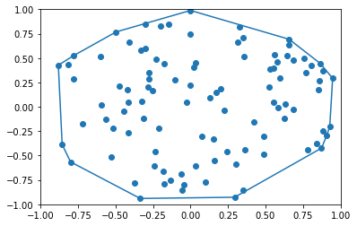

# 보이는 알고리즘!

|       |      |
| :---: | ---: |
|  기획   |  장석민 |
|  개발   |  장석민 |

## 개요
### 개발 동기
한 Youtube 채널에서 Google 입사 과정에서 가장 높을 관심을 받은 작품으로 알고리즘 시각화를 뽑았습니다. 공부와 포트폴리오 제작을 동시에 할 수 있는 방법으로 실력 향상에 도움이 될 것 같아 개발을 시작하게 되었습니다. 

### 개발 기간
**2019.09.30~2020.01.05**

### 개발 도구
- Godot Engine 3.0
- Krita 4.2.0
- Inkscape 0.92.3
- Visual Paradigm Community 16.0

## 개발 일정
|                   |                       |
| :---------------- | :-------------------: |
| 선정 조건 구체화         | 2019.09.30~2019.11.10 |
| 시각적으로 표현할 알고리즘 선정 | 2019.09.30~2019.11.10 |
| Mock-up 작업        | 2019.09.30~2019.11.10 |
| Godot Engine 연습   | 2019.09.30~2019.11.10 |
| 구현 목록 명세          | 2019.11.11~2019.11.24 |
| 소프트웨어 시스템 설계      | 2019.11.11~2019.11.24 |
| 구현                | 2019.11.25~2019.12.22 |
| 마무리               | 2019.12.23~2020.01.05 |

## 결과물
### 선정 조건
- 도형을 이용하여 표현이 가능하다.
- 표현 후 동작 구조를 쉽게 알 수 있다.
- 흥미를 끌 수 있는 소재이다.
- 개발 기간 4주 내에 구현이 가능하다.
- 상호작용이 가능하다.
- 적은 양의 데이터로 표현이 가능하다.
- 구현된 자료가 적다.

### 선정된 알고리즘
- Trie
- Gift Wrapping Algorithm
- ~~Fortune's Algorithm~~

### 선정 이유
#### Trie
- 트리 구조로 도형을 이용하여 표현이 간단하다.
- 빈도수 기반 자동 완성으로 사용 가능하여 짧은 문단을 이용하여 동작을 확인할 수 있다.
- 자동 완성 구현은 충분히 흥미를 끌 수 있다고 생각한다.

#### Gift Wrapping Alghorithm
- 2차원에서 동작하는 알고리즘으로 평면에 표현하기 적합하다.
- 조금 복잡할 것으로 예상되나 충분한 상호작용이 가능할 것으로 예상된다.

#### Fortune's Algorithm
- 구현된 자료가 적은 것을 고려했지만 너무 적어 알고리즘 자체를 알아내기도 힘들다.

### 알고리즘 연구
#### Trie
```python
# 트리를 구성할 노드
class Node():
   def __init__(self):
       self.children = dict()
       self.value = 0


# key를 이용하여 trie에 해당 key가 존재하는 지 확인
def find(node: Node, key: str):
    for char in key:
        if char in node.children:
            node = node.children[char]
        else:
            return None
    return node.value


# key를 이용하여 key를 삽입하고 값을 변화시킴
def insert(node: Node, key: str):
    for char in key:
        if char not in node.children:
            node.children[char] = Node()
        node = node.children[char]
    node.value += 1

if __name__ == '__main__':
    root = Node()
    test_string = 'cause carry carrer cast cast calm cast care calm'

    for s in test_string.split():
        insert(root, s)


    for k, v in root.children.items():
        print(k, v.value)
        for k, v in v.children.items():
            print('', k, v.value)
            for k, v in v.children.items():
                print('-', k, v.value)
                for k, v in v.children.items():
                    print('--', k, v.value)
                    for k, v in v.children.items():
                        print('---', k, v.value)
                        for k, v in v.children.items():
                            print('----', k, v.value)
```

```
c 0
 a 0
- u 0
-- s 0
--- e 1
- r 0
-- r 0
--- y 1
--- e 0
---- r 1
-- e 1
- s 0
-- t 3
- l 0
-- m 2
```



#### Gift Wrapping Algorithm (Jarvis marching)
```python
# 사용할 점 클래스
class Vertex:
    def __init__(self, x=0.0, y=0.0):
        self.x = x
        self.y = y
    def __sub__(self, rhs):
        return Vertex(self.x - rhs.x, self.y - rhs.y)
    def __repr__(self):
        return f'({self.x}, {self.y})'


# 2차원 벡터곱
def norm_cross(lhs :Vertex, rhs :Vertex):
    return lhs.x * rhs.y - lhs.y * rhs.x


# ccw는 세 점이 반시계 방향일 때 1 반환
def ccw(vertex1, vertex2, vertex3):
    lhs = vertex2 - vertex1
    rhs = vertex3 - vertex2
    c = norm_cross(lhs, rhs)
    
    if c < 0:
        return -1
    else:
        return 1


# 본격 jarvis march
def jarvis(v):
    h = []
    v.sort(key=lambda vtx: vtx.x)
    
    point_on_hull = v[0]
    i = 0
    while True:
        h.append(point_on_hull)
        endpoint = v[0]
        for j in range(1, len(v)):
            if endpoint == point_on_hull or ccw(h[i], endpoint, v[j]) == -1:
                endpoint = v[j]
        i = i + 1
        point_on_hull = endpoint
        if endpoint == h[0]:
            break
    return h
```



## 이후 진행 예정
- 목업 작업 완료
- 시스템 분석 및 명세
- 개발!
- 마무리!!